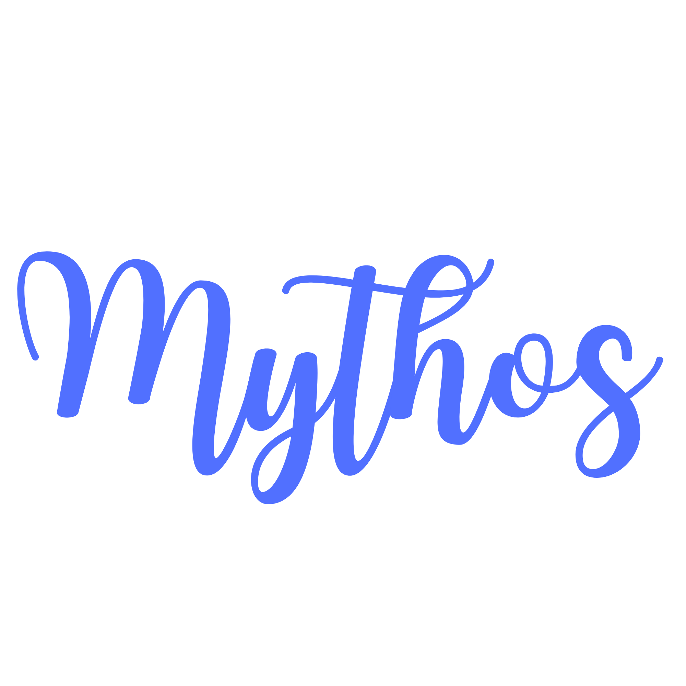

# Mythos

Mythos is an AI-powered collaborative storytelling platform where users can create, continue, refine, and co-manage stories in a chat-style experience.

It combines a FastAPI backend, React frontend, and MySQL persistence with LLM-assisted generation to keep narratives coherent and evolving.

## Highlights

- AI story generation with context continuity
- Story continuation and per-message refinement
- JWT-based authentication and user accounts
- Story sharing, access requests, and collaboration workflows
- Message reactions, reviews, and management controls
- Persistent storage for stories, messages, hints, and collaboration metadata

## Website Preview

<p align="center">
    
    
    
</p>

## Screenshot Slots (Drop Your Website Images Here)

Replace the `src` values below with your screenshot paths. Keep image widths as-is for clean alignment.

<table>
    <tr>
        <td align="center" width="50%"><strong>Home / Landing</strong></td>
        <td align="center" width="50%"><strong>Story Workspace</strong></td>
    </tr>
    <tr>
        <td align="center">
            
        </td>
        <td align="center">
            
        </td>
    </tr>
    <tr>
        <td align="center" width="50%"><strong>Sidebar / Story List</strong></td>
        <td align="center" width="50%"><strong>Sharing & Collaboration</strong></td>
    </tr>
    <tr>
        <td align="center">
            
        </td>
        <td align="center">
            
        </td>
    </tr>
</table>

## Architecture

- Frontend: React + Vite
- Backend: FastAPI + SQLAlchemy
- Auth: JWT bearer token flow
- AI Layer: Groq-backed generation and refinement services
- Database: MySQL

## Tech Stack

- Frontend: React 19, React Router, Tailwind CSS 4, Lucide Icons, React Icons
- Backend: FastAPI, SQLAlchemy, Pydantic, Uvicorn
- Auth/Security: python-jose, passlib, bcrypt
- AI/Networking: groq, httpx
- Database Driver: PyMySQL

## Project Structure

```text
.
|-- backend/
|   |-- app/
|   |   |-- ai/
|   |   |-- db/
|   |   |-- models/
|   |   |-- routes/
|   |   `-- utils/
|   |-- requirements.txt
|   `-- .env
|-- story-teller-ui/
|   |-- src/
|   |   |-- components/
|   |   `-- pages/
|   `-- package.json
`-- readme.md
```

## API Overview

Base URL: `http://localhost:8000`

### Authentication

- `POST /api/auth/register` - Register a new user
- `POST /api/auth/login` - Login and receive JWT token
- `GET /api/auth/me` - Get current authenticated user

### Stories

- `POST /api/stories` - Create story
- `GET /api/stories` - List user stories
- `GET /api/stories/{story_id}` - Get story by ID
- `GET /api/stories/hash/{hash_id}` - Get story by hash ID
- `DELETE /api/stories/{story_id}` - Delete a story

## Getting Started

### Prerequisites

- Python 3.9+
- Node.js 18+
- MySQL 8+

### 1) Backend Setup

```bash
cd backend
python -m venv .venv
.venv\Scripts\activate
pip install -r requirements.txt
```

Create `backend/.env`:

```env
DB_HOST=localhost
DB_PORT=3306
DB_USER=root
DB_PASS=your_password
DB_NAME=story_db
LLM_API_KEY=your_groq_api_key
```

Run backend:

```bash
uvicorn app.main:app --reload
```

### 2) Frontend Setup

```bash
cd story-teller-ui
npm install
npm run dev
```

### 3) Open the App

- Frontend: `http://localhost:5173`
- Backend docs: `http://localhost:8000/docs`

## Collaboration Flow

1. User creates a story.
2. Story can be shared with view/collaborate access.
3. Collaborators submit change requests.
4. Story owner reviews and approves/rejects changes.
5. Approved updates are reflected in the story thread.

## Environment Variables

Backend variables expected in `backend/.env`:

- `DB_HOST`
- `DB_PORT`
- `DB_USER`
- `DB_PASS`
- `DB_NAME`
- `LLM_API_KEY`

## Roadmap Ideas

- Story version history and branching
- Export to PDF/Markdown
- Team workspaces and shared libraries
- Prompt templates by genre

## License

This project is currently private/internal. Add a license section if you plan to open source Mythos.